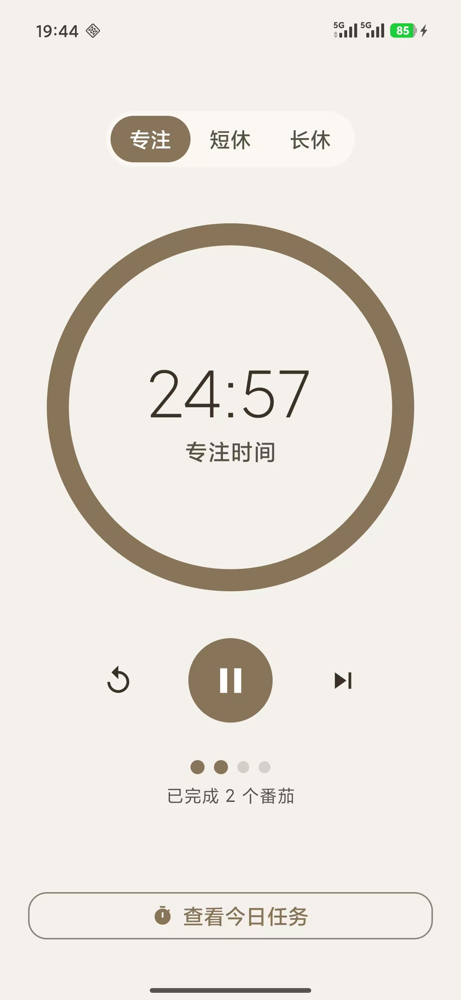
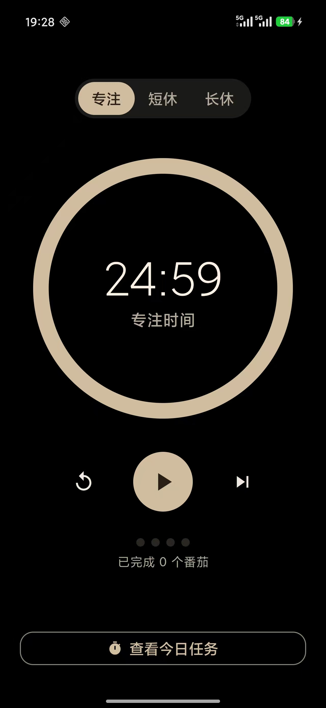
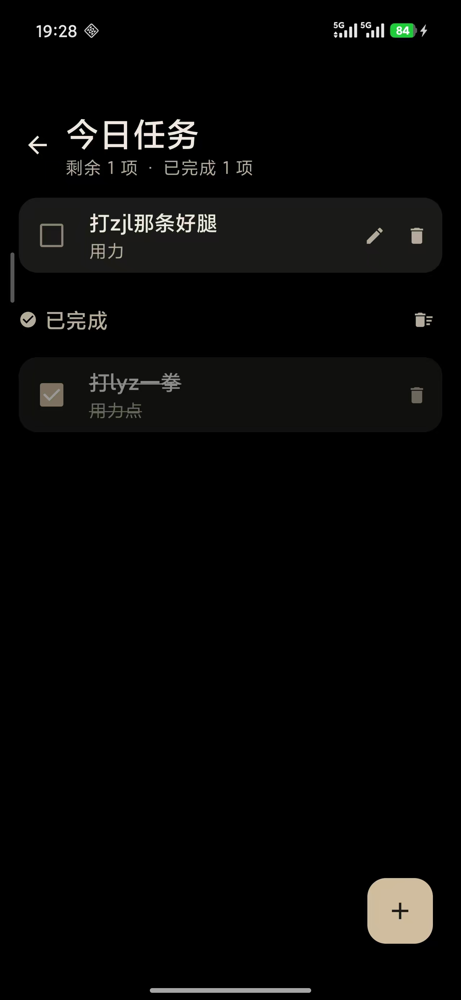

# 番茄钟 (Pomodoro Timer)

一个简洁的番茄钟应用，帮助你使用番茄工作法提高专注力。

## 功能

- **番茄计时器** — 25分钟专注 / 5分钟短休息 / 15分钟长休息，每4个番茄钟自动切换长休息
- **任务管理** — 创建、编辑、删除待办任务，支持提醒
- **通知提醒** — 专注结束、任务提醒、前台服务通知
- **后台运行** — 退出应用后计时器仍在后台运行

## 截图

| 番茄钟 | 深色模式 | 每日任务 |
|:---:|:---:|:---:|
|  |  |  |

## 技术栈

- **语言**: Kotlin
- **UI**: Jetpack Compose + Material 3
- **架构**: MVVM (无 DI 框架)
- **本地存储**: Room
- **导航**: Navigation Compose
- **构建**: Gradle + KSP

## 最低要求

- Android 8.0 (API 26) 及以上
